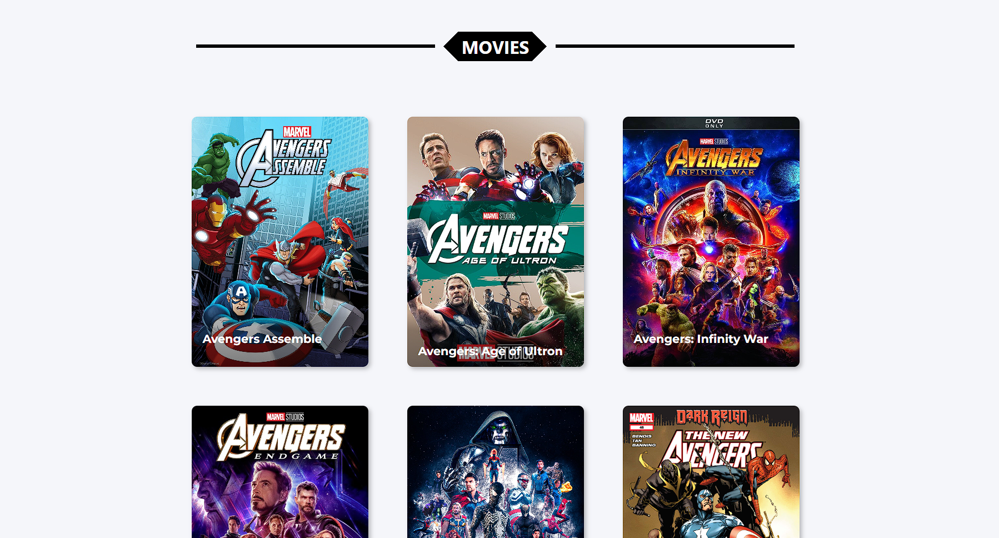
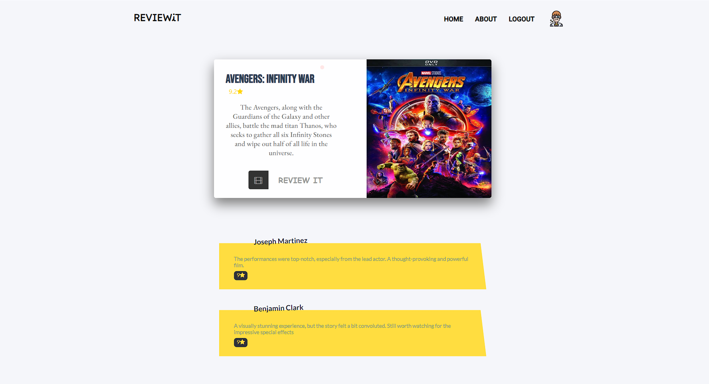

# REVIEWiT - Movie Review Website

REVIEWiT is a web application built using the MERN (MongoDB, Express.js, React.js, Node.js) stack along with JWT (JSON Web Tokens) for user authentication. The website allows users to browse movie reviews, post their own reviews, create an account, log in, and update their profile information.

## Features

- View movie reviews from other users.
- Post new movie reviews and share your opinions with the community.
- User authentication using JWT for secure login and registration.
- Update and manage your profile information.

## Screenshots

## Getting Started

### Prerequisites

- Node.js
- MongoDB

### Configuration

1. Rename `.env.example` to `.env` and update the environment variables with your configuration.

### Installation & run the application

1. Clone the repository: `git clone https://github.com/soham-basak/REVIEWiT.git`
2. Change into the project directory: `cd reviewit`
3. Change into the project directory: `cd backend`
4. Install server dependencies: `npm install`
5. Run the server: `npm start` or `npm run dev`
6. Change into the `client` directory: `cd frontend`
7. Install client dependencies: `npm install`
8. Run the client: `npm start`

The application will be accessible at `http://localhost:3000/` in your web browser.

## Technologies Used

- Frontend

  - React.js
  - React Router
  - Axios
  - Redux RTX Query Library

- Backend
  - Node.js
  - Express.js
  - MongoDB
  - Mongoose
  - JSON Web Tokens (JWT) for authentication
  - Bcrypt for password hashing

## Contributing

Contributions are welcome! Please fork the repository and submit a pull request.

## Authors

- [Dexter](https://github.com/soham-basak)
